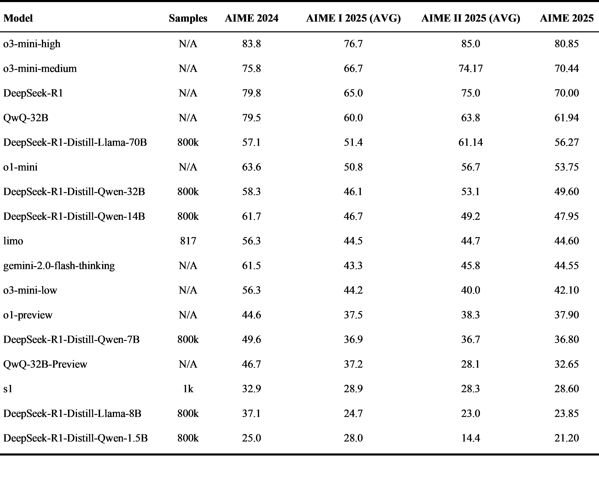
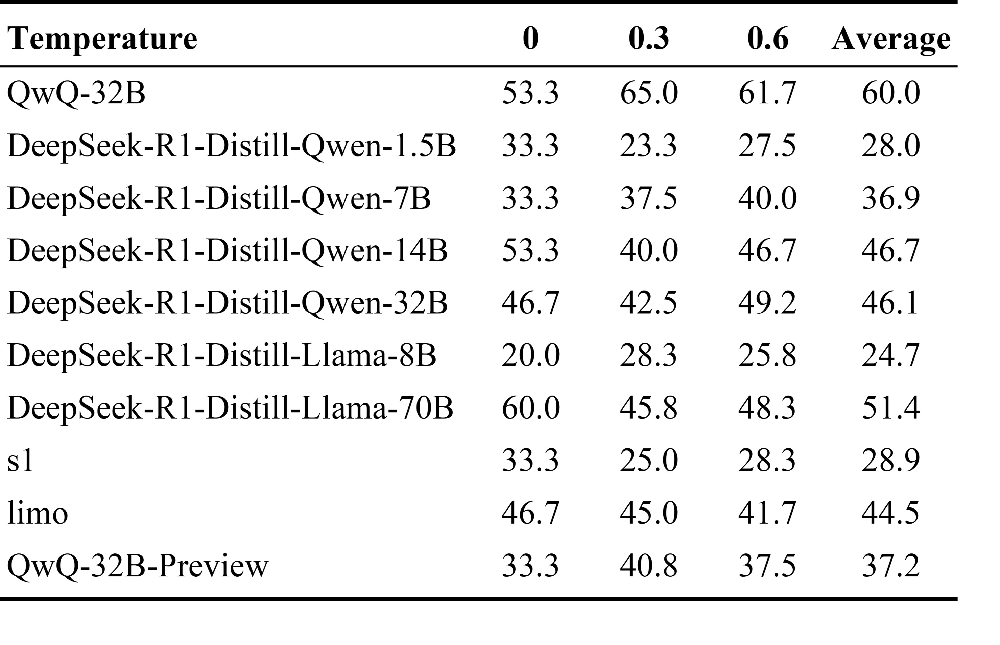

# AIME-Preview: A Rigorous and Immediate Evaluation Framework for Advanced Mathematical Reasoning

🚀 Real-time evaluation platform for mathematical reasoning models, featuring immediate results on AIME 2025 (released Feb 14, 2025).

## Latest Results

### AIME 2025  Results



The reported results for AIME 2025 represent the average performance across multiple temperature settings (0.0, 0.3, and 0.6). For detailed configuration parameters, please refer to the `Hyperparameter Configuration` section.

### Historical Performance
- AIME 2024
- AIME 2025 Part 1 
- AIME 2025 Part 2

## Models Under Evaluation

For detailed instructions and implementation details, please refer to `eval/README.md`.

### Open Models
- DeepSeek Series
  - DeepSeek-R1
  - DeepSeek-R1-Distill-Qwen (1.5B, 7B, 14B, 32B)
  - DeepSeek-R1-Distill-Llama (8B, 70B)
- O Series
  - o1-preview
  - o1-mini
  - o3-mini (low/medium/high)
- Others
  - gemini-2.0-flash-thinking
  - s1
  - limo
  - QwQ

## Evaluation Protocol


### Hyperparameter Configuration

#### API-Based Models

For O Series, DeepSeek-R1, and Gemini models, we utilize their default API configurations without modification and sample 8 times per question.

#### Locally Deployed Models

For all other models evaluated locally, we maintain consistent hyperparameters across all evaluations:

```python
{
    "temperature": [0.0, 0.3, 0.6],  # 0.3 used for AIME 2024
                                     # Average of all three used for AIME I 2025
    "n_sampling": 8,                 # Samples per question
    "max_tokens": 32768,             # Maximum response length
    "seed": 0,                       # Fixed seed for reproducibility
    "top_p": 0.95                    # Nucleus sampling parameter
}
```

## Temperature Impact Analysis

We conducted a comprehensive analysis of model performance across different temperature settings (0.0, 0.3, and 0.6) for AIME 2025. The result of AIME I 2025 is shown below:



Key findings include:

### Model-Specific Temperature Sensitivity

1. **Large Model Stability**
   - DeepSeek-R1-Distill-Llama-70B showed the highest average performance (51.4%) but exhibited significant variance across temperatures (60.0%, 45.8%, 48.3%)
   - DeepSeek-R1-Distill-Qwen-14B and 32B maintained relatively stable performance across all temperatures, with averages of 46.7% and 46.1% respectively

2. **Medium-Size Model Behavior**
   - DeepSeek-R1-Distill-Qwen-7B showed interesting temperature scaling, with performance improving as temperature increased (33.3% → 37.5% → 40.0%)
   - QwQ demonstrated optimal performance at temperature 0.3 (40.8%), with lower scores at both extremes

3. **Smaller Model Characteristics**
   - DeepSeek-R1-Distill-Qwen-1.5B and s1 showed similar patterns, performing best at temperature 0.0
   - DeepSeek-R1-Distill-Llama-8B uniquely performed best at temperature 0.3 (28.3%)

### Key Observations

- **Optimal Temperature Varies**: No single temperature setting was universally optimal across all models
- **Size Correlation**: Larger models generally showed more stability across temperature variations
- **Performance-Stability Tradeoff**: Models with higher average performance often showed greater sensitivity to temperature changes

### Recommendations

Based on these findings, we recommend:

1. **Model-Specific Tuning**: Consider individual temperature tuning for each model rather than using a fixed setting
2. **Ensemble Approach**: For critical applications, consider averaging results across multiple temperature settings
3. **Size Considerations**: For larger models (>14B parameters), temperature settings have less impact on final performance

This analysis has been incorporated into our evaluation protocol for future benchmarks.

## Contributors

[Yixin Ye](https://github.com/BLeaves), [Yang Xiao](https://github.com/XiaoYang66), Tiantian Mi, [Pengfei Liu](https://github.com/pfliu-nlp)

## Citaion

```bibtex
@misc{ye2025aimepreview,
    title = {AIME-Preview: A Rigorous and Immediate Evaluation Framework for Advanced Mathematical Reasoning},
    author = {Yixin Ye and Yang Xiao and Tiantian Mi and Pengfei Liu},
    year = {2025},
    howpublished = {\url{https://github.com/GAIR-NLP/AIME-Preview}},
    note = {GitHub repository}
}
```